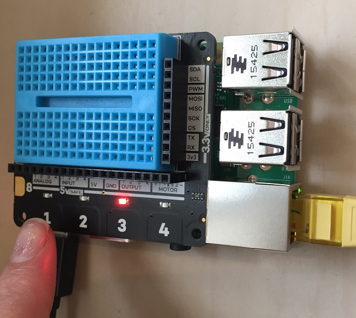

## الكثير من الأضواء!

- يمكن لبرنامجك اختيار ضوء عشوائي وتشغيله، ثم إيقاف تشغيله عند الضغط على الزر. أضف متغير `game_in_progress` وحلقة تكرارية إلى لعبتك بحيث يتم اختيار الأضواء بشكل عشوائي.
    
    يجب أن تبدو التعليمات البرمجية خاصتك بالشكل التالي:
    
    ```python
    import explorerhat
    from time import sleep
    import random
    
    # دالة button_pressed
    def button_pressed(channel, event):
        print("قمت بالضغط على زر"+str(channel) )
        explorerhat.light.off()
    
    # استمر في اللعب حتى تصبح game_in_progress تساوي False
    game_in_progress = True
    
    while game_in_progress:
    
        # اختر رقم ضوء بشكل عشوائي (1-4)
        light = random.randint(1, 4)
    
        # اختر مدة الانتظار قبل تشغيل الضوء
        wait_for_next = random.uniform(0.5, 3.5)
        sleep(wait_for_next)
    
        # تشغيل الضوء المحدد
        if light == 1:
            explorerhat.light.blue.on()
        elif light == 2:
            explorerhat.light.yellow.on()
        elif light == 3:
            explorerhat.light.red.on()
        elif light == 4:
            explorerhat.light.green.on()
    
        # عند الضغط على زر، استدعِ الدالة button_pressed 
        explorerhat.touch.pressed(button_pressed)
    
    ```
    
    لاحظ أنه في الوقت الحالي، يؤدي الضغط على **أي زر** إلى إطفاء الضوء، سواء كان هذا الزر يتوافق مع رقم الضوء أم لا! هذا ليس صحيحًا تمامًا، ولكننا سنصلحه لاحقًا.
    
    