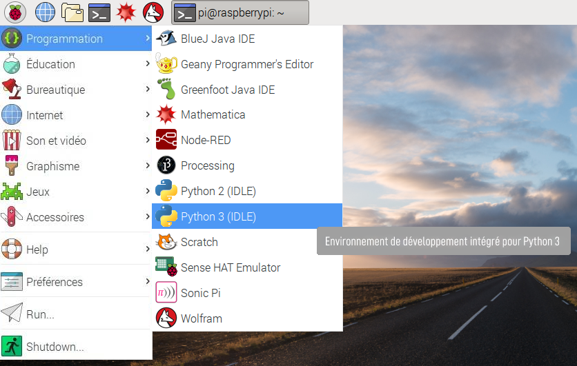

## Configuration

Avant de commencer, assure-toi que ton Raspberry Pi est éteint et débranché.

- Monte soigneusement l'Explorer HAT sur les broches GPIO de ton Raspberry Pi, puis démarre le Pi.

- Ouvre Python 3 depuis le menu Programmation :
    
    

- Crée un nouveau fichier en cliquant sur **Fichier** > **Nouveau fichier** et tape le code `import explorerhat` avant d'appuyer sur **F5** pour exécuter ton programme.

Si tout fonctionne, tu devrais voir un message indiquant « Explorer HAT Pro détecté... ». Sinon, vérifie que tu as [installé le logiciel](what-you-will-need) et que tu as correctement connecté ton Explorer HAT aux broches GPIO.