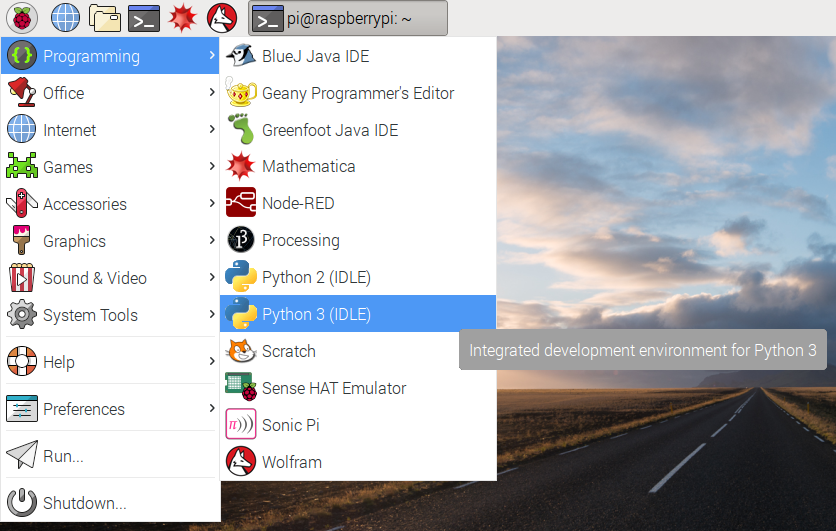

## स्थापना करना

शुरू करने से पहले, सुनिश्चित करें कि आपका Raspberry Pi की बिजली बंद है और वह बंद है।

- अपने Raspberry Pi की GPIO पिन पर एक्सप्लोरर HAT को सावधानी से माउंट करें, फिर Pi को बूट करें।

- प्रोग्रामिंग मेन्यू से Python 3 को खोले।
    
    

- अपने कार्यक्रम को चलाने के लिए एक नई फ़ाइल बनाएँ ** File** > **New File** पर क्लिक करें और ** F5 ** दबाने से पहले, कोड `import explorerhat` टाइप करें।

यदि सब कुछ काम कर रहा है तो आपको एक संदेश "Explorer HAT Pro detected..." दिखना चाहिए। यदि नहीं, तो जांचें कि आपके पास [सॉफ़्टवेयर स्थापित है](what-you-will-need), (software is installed) और आपने अपने Explorer HAT को GPIO पिन से सही तरीके से जोड़ा है।