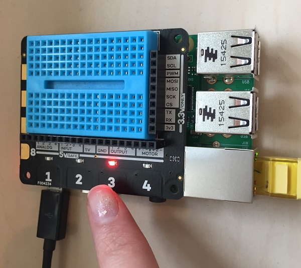

## ಆದರೆ ಅದು ಸರಿಯಾದ ಗುಂಡಿಯೇ?

ನಮ್ಮ ಆಟದ ಅಂತಿಮ ಭಾಗವೆಂದರೆ ಆಟಗಾರನು ಒತ್ತಿದ ಬಟನ್ ವಾಸ್ತವವಾಗಿ ಸರಿಯಾದ ಗುಂಡಿಯೇ ಎಂದು ಪರಿಶೀಲಿಸುವುದು. ಇದನ್ನು ಮಾಡಲು ನೀವು ನಿಮ್ಮ`button_pressed` function ಅನ್ನು ಮತ್ತೆ ಬದಲಾಯಿಸಬೇಕು. Function ನಿನ ಪ್ರಾರಂಭದಲ್ಲಿ, ವೇರಿಯಬಲ್ (Variable) `light` (ಆಯ್ಕೆಮಾಡಿದ ದೀಪದ ಸಂಖ್ಯೆ) ಮತ್ತು ವೇರಿಯಬಲ್ (Variable) `channel` (ಒತ್ತಿದ ಗುಂಡಿಯ ಸಂಖ್ಯೆ) ಸಮಾನವಾಗಿದೆಯೇ ಎಂದು ಪರಿಶೀಲಿಸಿ:

```python
def button_pressed(channel, event):
    if light == channel:
        print("Well done")
    else:
        print("Wrong button")
        global game_in_progress
        game_in_progress = False
```

ಮತ್ತೊಮ್ಮೆ, ವೇರಿಯೇಬಲ್(Variable) `game_in_progress` ನ ಮೌಲ್ಯವನ್ನು ನೀವು function ಒಳಗಿನಿಂದ ಬದಲಾಯಿಸಲು ಬಯಸುತ್ತೀರಿ ಎಂದು Python ‌ಗೆ ಸೂಚಿಸಲು `global` ಪದವನ್ನು ಬಳಸಬೇಕು.



ಅಷ್ಟೇ! ಈಗ ನಿಮ್ಮ ಆಟವನ್ನು ಸ್ನೇಹಿತರೊಂದಿಗೆ ಪರೀಕ್ಷಿಸಿ.