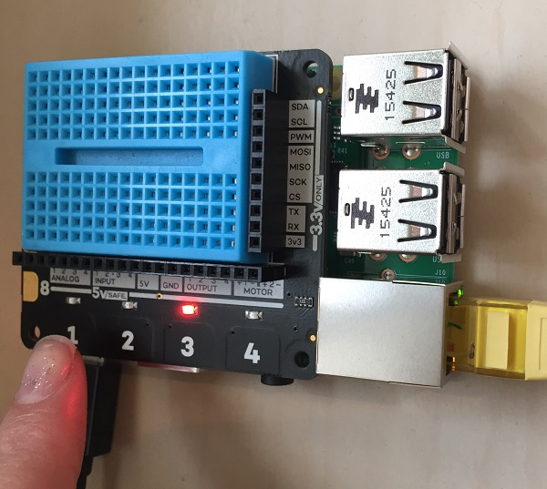

## ತುಂಬಾ ದೀಪಗಳು!

- ನಿಮ್ಮ ಪ್ರೋಗ್ರಾಂ random ಆಗಿ ದೀಪವನ್ನು ಆಯ್ಕೆ ಮಾಡಬಹುದು ಮತ್ತು ಬದಲಾಯಿಸಬಹುದು, ತದನಂತರ ಗುಂಡಿಯನ್ನು ಒತ್ತಿದಾಗ ಅದನ್ನು ಆಫ್ ಮಾಡಿ. `game_in_progress` variable ಮತ್ತು ಲೂಪ್ ಅನ್ನು ನಿಮ್ಮ ಆಟಕ್ಕೆ ಸೇರಿಸುವುದರಿಂದ ದೀಪಗಳನ್ನು random ಆಗಿ ಆಯ್ಕೆ ಮಾಡಬಹುದು.
    
    ಇಲ್ಲಿಯ ತನಕ, ನಿಮ್ಮಕೋಡ್ ಈ ರೀತಿ ಕಾಣಿಸಬೇಕು:
    
    ```python
    import explorerhat
    from time import sleep
    import random
    
    # The button_pressed function
    def button_pressed(channel, event):
        print("You pressed " + str(channel) )
        explorerhat.light.off()
    
    # Keep playing the game until game_in_progress becomes False
    game_in_progress = True
    
    while game_in_progress:
    
        # Randomly choose the number of a light (1-4)
        light = random.randint(1, 4)
    
        # Choose how long to wait before turning on the light
        wait_for_next = random.uniform(0.5, 3.5)
        sleep(wait_for_next)
    
        # Turn on the selected light
        if light == 1:
            explorerhat.light.blue.on()
        elif light == 2:
            explorerhat.light.yellow.on()
        elif light == 3:
            explorerhat.light.red.on()
        elif light == 4:
            explorerhat.light.green.on()
    
        # When a button is pressed, call the button_pressed function
        explorerhat.touch.pressed(button_pressed)
    
    ```
    
    ಈ ಸಮಯದಲ್ಲಿ ನೀವು ಗಮನಿಸಿದರೆ **ಯಾವುದೇ** ಬಟನ್ ಒತ್ತಿದರೂ, ದೀಪದ ಸಂಖ್ಯೆಗೆ ಅನುಗುಣವಾಗಿರಲಿ ಅಥವಾ ಇಲ್ಲದಿರಲಿ, ದೀಪವು ಆಫ್ ಆಗುತ್ತದೆ! ಅದು ಸರಿಯಲ್ಲ, ಆದರೆ ನಾವು ಅದನ್ನು ನಂತರ ಸರಿಪಡಿಸುತ್ತೇವೆ.
    
    