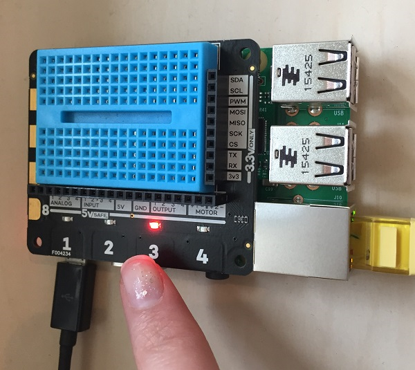

## Maar was het de juiste knop?

Het laatste deel van onze game is om te controleren of de knop die de speler indrukte de juiste knop was. Om dit te doen, moet je je `button_pressed` functie opnieuw bewerken. Voeg bij het begin van de functie code toe om te controleren of de variabele `light` (het nummer van het gekozen licht) gelijk is aan de variabele `channel` (het nummer van de ingedrukte knop):

```python
def button_pressed(channel, event):
    if light == channel:
        print("Goed gedaan")
    else:
        print("Verkeerde knop")
        global game_in_progress
        game_in_progress = False
```

Nogmaals, je moet Python vertellen dat je de waarde van de variabele `game_in_progress` wil veranderen vanuit de functie door het woord `global` te gebruiken.



Dat is het! Test nu je spel met je vrienden.