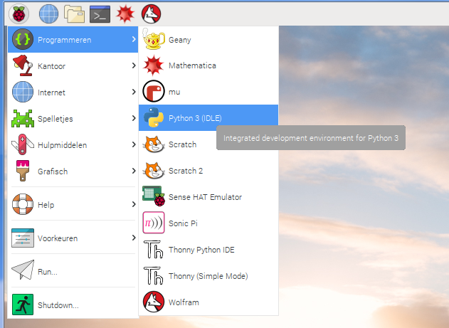

## Instellen

Zorg er voor dat voordat je begint je Raspberry Pi is uitgeschakeld en de voeding niet is aangesloten.

- Monteer voorzichtig de Explorer HAT op de GPIO-pinnen van je Raspberry Pi en start dan de Pi op.

- Open Python 3 in het programmeermenu:
    
    

- Maak een nieuw bestand door op **File** > **New File** te klikken en voer de code `import explorerhat` in voordat je op **F5** drukt om je programma uit te voeren.

Als alles werkt, zie je een bericht met de tekst "Explorer HAT Pro detected...". Zo niet, controleer dan of je de [software hebt geïnstalleerd](what-you-will-need), en dat je jouw Explorer HAT correct hebt aangesloten op de GPIO pinnen.