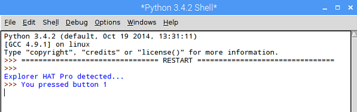

## Op de knop drukken

- Je moet weten wanneer de speler op een knop op de Explorer HAT drukt en op welke knop hij heeft gedrukt. Voeg **onder** je code deze regel toe:
    
    ```python
    explorerhat.touch.pressed(button_pressed)
    ```

- Wanneer op een knop wordt gedrukt, wordt de functie `button_pressed` (knop ingedrukt) aangeroepen, dus je moet deze functie schrijven. Zet de volgende code **aan het begin** van je bestand, net na de `import` codes:
    
    ```python
    def button_pressed(channel, event):
        print("Je drukte op knop " + str(channel) )
        explorerhat.light.off()
    ```
    
    De variabele `channel` bevat het nummer van de knop die werd ingedrukt (1-4). Test je programma en je zou moeten zien dat wanneer je op een knop drukt, het nummer van de knop die je hebt ingedrukt in de Python-shell wordt weergegeven en alle lichten worden uitgeschakeld.
    
    