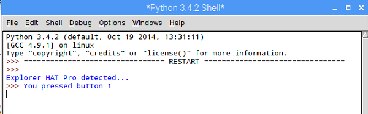

# Lights Out!

In this resource you will find out how to make a fun and fast-paced reaction game using the Explorer HAT.

The Explorer HAT has touch buttons labelled from 1 to 4, and four LED lights in different colours. The aim of the game is to program the Explorer HAT to turn a light on at random; the player must press the corresponding button to turn the light off. If the player is too slow, or if they press the wrong button, the game is over.

## Setting up 

Before you start, make sure your Raspberry Pi is powered down and switched off. 

1. Carefully mount the Explorer HAT onto the GPIO pins on your Raspberry Pi, then boot the Pi.

2. Open Python 3 from the Programming menu: 
    
    

3. Create a new file by clicking **File** > **New File** and type the code `import explorerhat` before pressing **F5** to run your program.

If everything is working you should see a message saying "Explorer HAT Pro detected...". If not, check that you have [installed the software](software.md), and that you have connected your Explorer HAT correctly to the GPIO pins. 


## Turning lights on 

1. You can use Python to tell the Explorer HAT which lights to turn on and off. Add the new lines of code into your Python file, then run the program to see what it does:

    ```python
    import explorerhat
    from time import sleep

    explorerhat.light.red.on()
    sleep(2)
    explorerhat.light.red.off()
    sleep(1)
    explorerhat.light.on()
    sleep(5)
    ```

    Can you work out how to do make your program do these things? 
    
    * Turn the other coloured lights on individually (blue, yellow, green)
    * Turn all of the lights off at once
    * Change the length of time for which the lights are turned on and off 

## Using the random library

This would be a pretty easy game if the lights always came on in the same order, for the same length of time! To make it as tricky as possible for the player, you need to add some randomness. You will randomize which light is turned on, and how long the program will wait before turning the next light on.

1. To generate random numbers, you need to use Python's `random` library. Find the line in your program that says `from time import sleep`, and underneath it type in `import random`. Delete all of the code beneath this (where you experimented with turning the lights on and off).

2. First, you will ask Python to choose a random light to turn on. Add this code to your program:

    ```python
    light = random.randint(1,4)
    ```

    This code chooses a random integer (whole number) between 1 and 4 and assigns it to the variable `light`. 

3. Now add some code to turn one light on depending on the number which was randomly chosen. Can you finish off the rest of the code? Note that 3 is the red light and 4 is the green light:

    ```python
    if light == 1:
        explorerhat.light.blue.on()
    elif light == 2:
        explorerhat.light.yellow.on()
    ```

    Run your program several times. Cheack that, each time the program runs, a different light is randomly chosen. The light should turn on immediately. 

4. To make the game more fun, there needs to be an unpredictable gap between the lights turning on, so let's add some code to wait a random length of time before turning on the next light:

    Underneath the code where you chose which light to turn on, add two new lines of code:

    ```python
    light = random.randint(1,4)     
    
    wait_for_next = random.uniform(0.5, 3.5)
    sleep(wait_for_next)
    ```
    This time you are using the `random.uniform` function which allows you to choose numbers with fractional parts (decimals). In the code above, Python chooses a number which could be anything between half (0.5) and 3 and a half (3.5) and then waits for that number of seconds. You can change these values if you want to be more (or less) mean to your player!


## Pressing the button

1. You need to know when the player presses a button on the Explorer HAT, and which button it was that they pressed. At the **bottom** of your code, add this line:

    ```python
    explorerhat.touch.pressed(button_pressed)
    ```

2. When a button is pressed, the `button_pressed` function will be called, so you need to write this function. Put the following code at the **start** of your file, just after the `import` statements:

    ```python
    def button_pressed(channel, event):
        print("You pressed button " + str(channel) )
        explorerhat.light.off()
    ```

    The variable `channel` contains the number of the button that was pressed (1-4). Test your program and you should see that when you press a button, the number of the button you pressed is displayed in the Python Shell and all lights switch off.

    


## Lots of lights!
1. Your program can choose and switch on a random light, and then switch it off when a button is pressed. Add a `game_in_progress` variable and a loop to your game so that lights keep being randomly chosen. 

    Your code so far should look like this:

    ```python
    import explorerhat
    from time import sleep
    import random

    # The button_pressed function
    def button_pressed(channel, event):
        print("You pressed " + str(channel) )
        explorerhat.light.off()

    # Keep playing the game until game_in_progress becomes False
    game_in_progress = True

    while game_in_progress:

        # Randomly choose the number of a light (1-4)
        light = random.randint(1, 4)

        # Choose how long to wait before turning on the light
        wait_for_next = random.uniform(0.5, 3.5)
        sleep(wait_for_next)

        # Turn on the selected light
        if light == 1:
            explorerhat.light.blue.on()
        elif light == 2:
            explorerhat.light.yellow.on()
        elif light == 3:
            explorerhat.light.red.on()
        elif light == 4:
            explorerhat.light.green.on()

        # When a button is pressed, call the button_pressed function
        explorerhat.touch.pressed(button_pressed)

    ```
    Notice that at the moment pressing **any** button will turn the light off! That's not quite right but you will fix it later.
    

## Adding a timer

After you switch a light on, you need to start a timer and check how long the player takes to press the button. 

1. Firstly, you will need to tell Python to import the time function. Next to your other `import` statements, add the line `from time import time` to tell Python you want to use the `time` function.

2. Go to the place in your program just before the line of code checking for the button being pressed. Create a variable called `start` to record the current time - this will be provided by your Raspberry Pi and is pretty accurate.

    ```python
    # ...other code above

    # Record the current time
    start = time()
     
    # ... other code below

    ```

3. You can choose how many seconds the player will have to press the button once a light is turned on. Add a **constant** to your program just after the `game_in_progress` variable with the value you have chosen. I chose to allow my player 1.5 seconds:


    ```python
    game_in_progress = True
    TIME_ALLOWED = 1.5

    ```

    The smaller the number, the quicker the player will have to be!


4. Now add a loop to keep checking whether the user has run over the amount of time they were allowed to take. You can think of the purpose of this loop like someone on a long car journey who keeps asking "are we nearly there yet?", "are we there now?", "how about now?"! :)

    ```python
    ...

    # Record the current time
    start = time()

    waiting_for_press = True
    while waiting_for_press and game_in_progress:

        # What's the time now?
        now = time()
        time_taken = now - start

        # Check if they have taken more time than they were allowed
        if time_taken > TIME_ALLOWED:
            print("You took too long!")
            explorerhat.light.off()
            game_in_progress = False    # Lose the game
          
        else:
            explorerhat.touch.pressed(button_pressed)


    ```

    Move the code for dealing with button presses to be part of the `else` - you will need to **indent** it to be in the right place. 

5. If you run this code you will see that even if you press the right button extremely quickly, the program will still declare you to have taken too long. This is because you haven't told the game to stop checking if time is up when a button is pressed. Alter your `button_pressed` function to tell the code to stop the timer when a button is pressed.

    ```python
        def button_pressed(channel, event):
            print("You pressed " + str(channel) )

            explorerhat.light.off()

            global waiting_for_press
            waiting_for_press = False

    ```

    In this code, `global` allows us to change the value of the variable `waiting_for_press` from inside the function.


## But was it the right button?
The final part of our game is to check if the button the player pressed was in fact the right button. To do this you need to edit your `button_pressed` function again. At the start of the function, add code to check whether the variable `light` (the number of the chosen light) is equal to the variable `channel` (the number of the button pressed):

```python
def button_pressed(channel, event):
    if light == channel:
        print("Well done")
    else:
        print("Wrong button")
        global game_in_progress
        game_in_progress = False
```

Once again, you will need to tell Python that you want to change the value of the variable `game_in_progress` from inside the function by using the word `global`.


That's it! Now test your game with your friends.


## What next?
* Change the messages the player receives when they press the right or wrong button
* Allow the player to play again if they lose, without having to press F5 to run the program again
* Add a 'streak' counter which adds one every time a light is turned off, and tells the user how many lights they successfully turned off in a row when they lose the game.
* Change the amount of time the person has to turn the light off to be a random chosen number
* Allow the user to choose a difficulty level, and alter the time they are allowed depending on the difficulty level they chose
* Change your game to use the capacitive touch inputs on the Explorer HAT (5-8) so that instead of pressing the buttons the user might have to press a banana, marshmallow, jelly baby or other interesting conductive physical objects!


